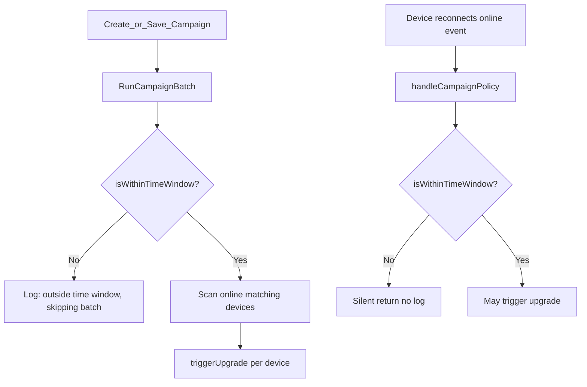

# Firmware Campaign Time Window 使用说明

> **适用版本**：Oktopus controller（Campaign 引擎）  
> **相关代码**：`backend/services/controller/internal/api/campaign_engine.go`  
> **关联文档**：[postmortem-campaign-firmware-upgrade-2026-05.md](./postmortem-campaign-firmware-upgrade-2026-05.md)、[plans/2026-03-23-firmware-campaigns.md](./plans/2026-03-23-firmware-campaigns.md)

---

## 1. 概述

Firmware Campaign 的 **Time Window（时间窗口）** 用于限制固件升级**只允许在指定 UTC 时段内执行**，避免在用户活跃时段批量升级导致断网、重启或服务中断。

**重要：** Time Window 限制**允许升级**的 UTC 时段。自 controller 调度器启用后，**每个窗口周期会自动触发一次 batch**（无需在窗口内手动 Save）。仍建议在窗口外 Save 时预期会跳过 batch；`on_connect` 路径不变。

---

## 2. 日志说明

### 2.1 `outside time window, skipping batch`

典型日志：

```text
campaign_engine: outside time window, skipping batch for campaign <id> (matching devices will be picked up by on_connect when they reconnect inside the window)
```

来源：`RunCampaignBatch`（`campaign_engine.go`），在创建或保存 enabled Campaign 时异步触发。

| 片段 | 含义 |
|------|------|
| `outside time window` | 当前 UTC 时间不在 Campaign 的 `time_window_start` ~ `time_window_end` 范围内 |
| `skipping batch` | 本次批量扫描在线设备被跳过，不会对已在线设备发起升级 |
| `...on_connect when they reconnect inside the window` | 窗口内若设备重新上线，会走 `handleCampaignPolicy` 单独检查并可能升级 |

**为何连续出现两次？** `RunCampaignBatch` 仅在创建或保存 enabled Campaign 时触发。间隔数秒的重复日志，通常是创建后又保存了一次。

### 2.2 正常触发时的日志

- `campaign_engine: X device(s) match campaign ... hardware`
- `campaign_engine: starting batch upgrade for campaign ...`
- `campaign_engine: triggering firmware upgrade for device ...`

---

## 3. Time Window 判断规则

实现：`isWithinTimeWindow()` in `campaign_engine.go`

| 规则 | 说明 |
|------|------|
| 时区 | **UTC**。UI 标签为 `Start (UTC)` / `End (UTC)` |
| 结束时间 | **开区间**。`06:00` 表示窗口在 06:00 整之前结束（即最晚到 05:59） |
| Anytime | `time_window_start` 与 `time_window_end` **均为空**时不限制；只填一个不会禁用窗口 |
| 跨午夜 | start > end（如 `22:00–06:00`）表示 overnight 窗口 |

示例：窗口 `00:00–06:00 UTC`，在 `06:20 UTC` 保存 Campaign → 超出窗口 → 出现 `outside time window, skipping batch`（**预期行为，非故障**）。

---

## 4. 升级触发机制



### 两种触发路径

| 路径 | 何时触发 | 适用场景 |
|------|----------|----------|
| **Batch（`campaign_start`）** | 创建或保存 enabled Campaign 时 | 处理**当前已在线**的匹配设备 |
| **On Connect（`on_connect`）** | 设备在窗口内**重新上线**时 | 窗口外一直在线的设备、或 batch 未覆盖到的设备 |

Controller 启动时只订阅 `device.v1.*.online`，**不会**对已有 enabled Campaign 自动跑 batch，也**没有** cron 在窗口开始时自动 batch。

---

## 5. 正确使用方式

### 场景 A：只在维护窗口升级（最常见）

1. 创建 Campaign，勾选 Time Window，填写 **UTC** 起止时间
2. **在窗口内** Save，触发 batch 处理已在线设备
3. 窗口外上线/重连的设备会被跳过；窗口内重连时由 on_connect 自动升级
4. 设置合理 **Concurrency**（默认 10）

### 场景 B：立即升级所有在线设备

1. **不勾选** Time Window（Anytime）
2. 创建或保存 Campaign → 立即 batch

### 场景 C：已在窗口外创建/保存了 Campaign

1. 等到 UTC 进入窗口
2. **再次 Save**（无需改配置），或让设备在窗口内断开重连
3. 观察是否出现 `starting batch upgrade`

### 配置注意

- 时区一律 **UTC**（UTC+8 需自行换算，例如北京时间凌晨 2–5 点 ≈ UTC 前一日 18:00–21:00）
- 结束时间不含整点；若希望包含 06:00，应设 end 为 `06:01` 或 `07:00`
- 设备 FW Policy 须为 `campaign`（默认）；`manual` / `skip` 不走 Campaign
- 设备 `version` 须低于固件 `build_version` 才会升级

---

## 6. 时间窗口自动 Batch（Campaign Scheduler）

Controller 启动后运行 **Campaign Scheduler**（默认每 60 秒 tick，可通过环境变量配置）：

| 环境变量 | 默认 | 说明 |
|----------|------|------|
| `CAMPAIGN_SCHEDULER_ENABLED` | `true` | 是否启用 |
| `CAMPAIGN_SCHEDULER_INTERVAL_SEC` | `60` | tick 间隔（最小 30 秒） |

行为：

- 仅处理 **enabled** 且配置了 **Time Window** 的 Campaign
- 当前 UTC 在窗口内且本窗口周期尚未成功执行过 → 自动 `RunCampaignBatch`（`trigger_type=campaign_scheduled`）
- 使用 Mongo 字段 `last_scheduled_window_key` / `scheduled_batch_status` 去重；失败可在同一窗口内重试；`in_progress` 超过 10 分钟 lease 可被接管
- Controller **窗口内重启**可补跑（若本周期尚未 success）

日志前缀：`campaign_scheduler:`

---

## 6b. 历史说明（调度器之前）

在调度器加入之前，平台**没有**「到点自动开始升级」；下列变通仍适用于关闭调度器的环境：

| 能力 | 实际行为 | 是否定时 |
|------|----------|----------|
| Campaign Time Window | 限制允许升级的 UTC 时段 | 否 |
| Campaign Batch | 创建/保存 Campaign 时立即扫描 | 否 |
| On Connect 升级 | 窗口内设备重连时检查 | 否 |
| Mass Actions 固件升级 | 创建后立即执行 | 否 |

若需要定时效果，当前变通方案：

1. 外部 cron 在 UTC 窗口内调用 `PUT /api/tenants/{slug}/campaigns/{id}` 触发 batch
2. 窗口内让设备自然/人工重连，依赖 on_connect
3. 关闭 Time Window，需要时手动 Save（Anytime）

---

## 7. 未触发升级的其他原因

进入时间窗口后仍无升级时，按以下项排查（详见 [postmortem](./postmortem-campaign-firmware-upgrade-2026-05.md)）：

| 检查项 | 现象 / 日志 |
|--------|-------------|
| 设备 FW Policy 为 `manual` 或 `skip` | `skip ... fw policy is skip` |
| 设备版本已与固件 `build_version` 一致 | `skip ... already on target version` |
| 失败次数 ≥ 3 | `skip ... max retries` |
| pending/downloading 未超过 15 分钟 | `skip ... upgrade in progress` |
| Controller 镜像过旧 | `no responders`、batch 完全失败 |
| 设备一直在线、未在窗口内重连且未在窗口内 Save | 无 batch/on_connect 触发 |

---

## 8. 测试指南

### 8.1 测试前准备

| 项 | 要求 |
|----|------|
| 服务 | controller、adapter、对应 MTP（mqtt/ws）已运行 |
| 测试设备 | **在线**，Vendor/Model/HW Version 与 Campaign 一致 |
| 固件 | 已上传，`build_version` **高于**设备当前 `version` |
| 设备 Policy | **Campaign**（设备 Info 页 → Firmware Policy） |
| 时间 | `date -u` 查看当前 UTC |

### 8.2 测试 1：窗口外保存（预期不升级）

1. `date -u`（例：`06:20 UTC`）
2. Time Window = `00:00` – `06:00` UTC，Enabled，保存
3. **预期：** `outside time window, skipping batch`；无 upgrade log

```bash
docker compose logs -f controller 2>&1 | grep campaign_engine
```

### 8.3 测试 2：窗口内 Batch（核心）

1. 设 Time Window 包含当前 UTC（例：当前 14:30 → `14:00` – `16:00`）
2. 在窗口内 Save
3. **预期：** `starting batch upgrade`、`triggering firmware upgrade`；Upgrade Log 有 `campaign_start`

### 8.4 测试 3：On Connect

1. Campaign 启用，窗口包含当前 UTC
2. 窗口内重启 CPE 或断开 MQTT 再连
3. **预期：** `triggering firmware upgrade`；Upgrade Log 中 `trigger_type` = `on_connect`

### 8.5 测试 4：Anytime 对照

1. 不勾选 Time Window，Save
2. **预期：** 立即 batch（仍受版本/policy 约束）

### 8.6 验证位置

| 位置 | 内容 |
|------|------|
| Controller 日志 | `campaign_engine:` 前缀 |
| UI | Mass Actions → Firmware Campaigns → Upgrade Log |
| API | `GET /api/tenants/{slug}/campaigns/{id}/logs` |

**技巧：** 不必等到真实凌晨；将窗口设为当前 UTC 前后 1–2 小时即可立刻测试。

---

## 9. 客户说明（可直接转发）

### 一句话

Time Window 是**维护时段**，不是定时闹钟。只有在这个时段内系统才允许升级。要升级已在线设备，请在窗口内**保存 Campaign**；或让设备在窗口内**重连**。在窗口外保存不会立刻升级，这是正常行为。时间请按 **UTC** 填写。

### 稍完整版

Firmware Campaign 的 Time Window 用于设定**只允许在这个时段内做固件升级**，避免在业务高峰影响用户。

- **不是**「到点自动开始升级」；是**允许升级的时间段**
- 窗口内 Save Campaign → 对当前在线设备批量升级
- 窗口内设备重连 → 自动检查并升级
- 窗口外 Save → 不会立即升级（日志 `outside time window` 为预期行为）
- 时间按 **UTC** 配置，需换算本地时间

若需「每天固定时间自动批量升级」，当前需外部定时任务在窗口内调用 API，或作为后续产品增强。

---

## 10. 已知限制与可选改进

| 限制 | 说明 |
|------|------|
| 无窗口开始自动 batch | 窗口开始时不会自动扫描设备 |
| 窗口外 on_connect 无日志 | 静默跳过，不易从日志发现 |
| 仅 UTC | UI 未提供本地时区换算 |

可选改进方向：

- Campaign 窗口开始时自动 `RunCampaignBatch` 的定时调度器
- 跳过时输出当前 UTC 与配置窗口
- UI 显示「当前是否在窗口内」状态

---

## 11. 相关 API

| 方法 | 路径 | 说明 |
|------|------|------|
| GET | `/api/tenants/{slug}/campaigns` | 列表（含 `time_window_start/end`） |
| POST | `/api/tenants/{slug}/campaigns` | 创建（enabled 时触发 batch） |
| PUT | `/api/tenants/{slug}/campaigns/{id}` | 更新（enabled 时触发 batch） |
| GET | `/api/tenants/{slug}/campaigns/{id}/logs` | 升级日志 |
| GET/PUT | `/api/tenants/{slug}/device/{sn}/fw-policy` | 设备固件策略 |
