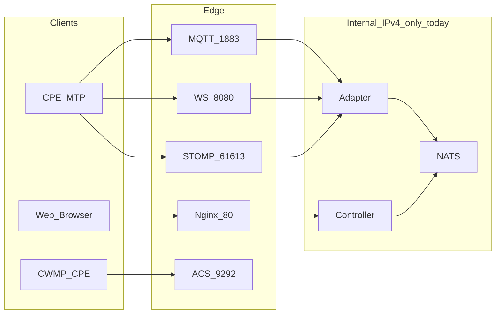

# IPv6 支持改造清单

> **状态**：规划文档（当前版本**未正式支持** IPv6）  
> **日期**：2026-05-20  
> **关联**：默认部署见 [`deploy/compose/docker-compose.yaml`](../deploy/compose/docker-compose.yaml)

---

## 1. 现状摘要

Oktopus 当前按 **IPv4 单栈** 设计与部署。代码与配置中**没有** IPv6 端到端测试、文档或运维流程。

| 类别 | 现状 |
|------|------|
| Docker 网络 | `usp_network` 仅 IPv4 子网 `172.16.235.0/24` |
| 宿主机端口发布 | 多为 `port:port` 或 `0.0.0.0:port`，未显式 `[::]:port` |
| 应用监听 | 部分 Go 服务用 `:port`（容器内可能双栈）；controller/ACS/registry 等显式 `0.0.0.0` |
| Nginx | 容器内已有 `listen [::]:80`，但外层 Docker/宿主机未必可达 IPv6 |
| 设备管理 UI | 可**展示** CPE 的 IPv6 接口参数（TR-181），≠ 平台接受 IPv6 连接 |
| 文档 / 测试 | 无 IPv6 部署说明与自动化测试 |

**结论：** 生产环境请继续使用 **IPv4**；IPv6 需按本文清单分阶段改造并验收。

---

## 2. 连接路径与改造范围



| 路径 | 端口 | 对外暴露 | 当前 IPv6 就绪度 | 优先级 |
|------|------|----------|------------------|--------|
| Web UI / REST API | 80（compose 映射 8090） | 是 | 低（Nginx 有 `[::]`，Docker/发布未配） | P1 |
| USP MQTT | 1883 / 8883 | 是 | 中（`:port` 监听，Docker 未发布 v6） | P0 |
| USP WebSocket | 8080 | 是 | 中 | P0 |
| USP STOMP | 61613 | 是 | 中 | P1 |
| CWMP ACS | 9292 | 是（`0.0.0.0`） | 低 | P1 |
| Container Registry | 443 | 是 | 低（`REGISTRY_HTTP_ADDR=0.0.0.0`） | P2 |
| Socket.IO（经 Nginx） | /socket.io | 经 Nginx | 随 Nginx | P1 |
| NATS / Mongo / 内部服务 | 4222 等 |  mostly localhost / 内网 | 可不对外 v6（内网仍 v4 即可） | P3 |

---

## 3. 分阶段改造清单

### Phase 0 — 需求与基线（1–2 天）

- [ ] 明确范围：仅 CPE MTP IPv6？Web UI IPv6？CWMP IPv6？全部？
- [ ] 确认客户网络：前缀委派、PD、DNS AAAA、防火墙策略
- [ ] 确认 CPE 侧：MQTT/WS 是否支持 IPv6 连接、证书校验是否含 v6 地址
- [ ] 在测试环境记录基线：`ss -tlnp`、`docker network inspect`、各服务实际监听地址
- [ ] 定义验收标准（见 [第 7 节](#7-验收标准)）

### Phase 1 — 宿主机与 Docker 基础设施（P0）

**文件：** `deploy/compose/docker-compose.yaml`、Docker daemon 配置

- [ ] 宿主机启用 IPv6（内核参数、`ip -6 addr` 有 global 地址）
- [ ] Docker daemon 启用 IPv6（`/etc/docker/daemon.json`）：

```json
{
  "ipv6": true,
  "fixed-cidr-v6": "fd00:dead:beef::/64"
}
```

- [ ] Compose 网络 `usp_network` 增加 IPv6：

```yaml
networks:
  usp_network:
    driver: bridge
    enable_ipv6: true
    ipam:
      config:
        - subnet: 172.16.235.0/24
          gateway: 172.16.235.1
        - subnet: fd00:dead:beef:235::/64
          gateway: fd00:dead:beef:235::1
```

- [ ] 端口发布改为双栈（示例）：

```yaml
ports:
  - "1883:1883"           # 默认通常仅 v4
  - "[::]:1883:1883"      # 显式 IPv6（按 Docker 版本语法调整）
```

- [ ] 验证：`curl -6 http://[::1]:8090/`、`nc -6 -v <host> 1883`

**风险：** 固定 `ipv4_address` 与 IPv6 并存时需验证 Compose 是否冲突；不同 Docker 版本 `[::]:port` 语法略有差异。

### Phase 2 — 边缘代理 Nginx（P1）

**文件：** [`deploy/compose/nginx.conf`](../deploy/compose/nginx.conf)

- [ ] 已存在 `listen [::]:80;`，确认容器内 `nginx -T` 显示 v6 监听
- [ ] Rate limit 区使用 `$binary_remote_addr` — **IPv6 地址更长（128 bit）**，需评估：
  - [ ] 增大 zone 大小（如 `10m` → `20m`）
  - [ ] 或改用 `$binary_remote_addr$remote_addr` 映射 / 自定义 key
- [ ] 日志格式 `$remote_addr` 对 IPv6 可工作，确认日志可读性
- [ ] `proxy_set_header X-Real-IP` / `X-Forwarded-For` 传递 IPv6 客户端地址
- [ ] 若前端通过绝对 URL 访问 API，确认无硬编码 IPv4
- [ ] 生产映射：除 `8090:80` 外增加 `[::]:8090:80` 或统一用 80/443 双栈发布

### Phase 3 — 设备接入 MTP 服务（P0）

#### MQTT

**文件：** `backend/services/mtp/mqtt/internal/listeners/mqtt/mqtt.go`（`:1883` 监听）

- [ ] 确认 mochi-co/mqtt `listeners.NewTCP` 在容器双栈下同时接受 v4/v6
- [ ] TLS 8883 证书 SAN 含服务域名 AAAA 或通配域名
- [ ] CPE 配置文档：Broker 填 IPv6 时需方括号 `[2001:db8::1]` 或域名（AAAA）

#### WebSocket

**文件：** `backend/services/mtp/ws/internal/ws/ws.go`

- [ ] `http.ListenAndServe(c.Port, r)` — `Port` 为 `:8080` 时在双栈容器内通常 OK
- [ ] ws-adapter 连接地址 `WS_ADDR` 勿写死 IPv4；支持 hostname + AAAA 解析
- [ ] 设备 Overview 页 CPE Settings 中 WebSocket Path/URL 说明是否需 IPv6 示例

#### STOMP

**文件：** `backend/services/mtp/stomp/server/server.go`

- [ ] `net.Listen("tcp", addr)` — 确认 `DefaultAddr :61613` 双栈行为
- [ ] 与 MQTT/WS 相同做端口双栈发布

#### CWMP ACS

**文件：** `backend/services/acs/internal/server/server.go`、`docker-compose.yaml`（`0.0.0.0:9292`）

- [ ] Compose 改为 `:9292:9292` 或 `[::]:9292:9292`，避免宿主机仅绑 v4
- [ ] ACS URL 给 CPE 时支持 AAAA / IPv6 literal
- [ ] CWMP `ScheduleDownload` 等与连接无关，一般无需改

### Phase 4 — 控制面与显式 IPv4 绑定（P1）

**需改 `0.0.0.0` 或评估是否仅内网的服务：**

| 服务 | 文件 | 当前 | 建议 |
|------|------|------|------|
| Controller REST | `backend/services/controller/internal/api/api.go` | `0.0.0.0:port` | 内网仅 v4 可保持；若需 v6 改为 `:port` |
| ACS | `backend/services/acs/...` | `:9292` | 随 Phase 3 |
| Registry | compose env `REGISTRY_HTTP_ADDR=0.0.0.0:5000` | v4 only | 改为 `0.0.0.0:5000` + v6 或 `:5000` |
| Bulkdata HTTP | `backend/services/bulkdata/http/internal/api/api.go` | `0.0.0.0` | 按需 |

**内部服务（可维持 IPv4-only）：**

- NATS `127.0.0.1:4222` — 仅本机/容器间，可不暴露 v6
- Mongo `27017` — 内网
- adapter / controller / socketio — 经 Docker 内网 DNS，v4 即可

### Phase 5 — TLS 与证书（P1）

**文件：** `deploy/compose/registry-certs-generator/generate_certs.sh`、MQTT/WS TLS 配置

- [ ] 证书 SAN 包含：
  - DNS 名称（推荐，同时有 A + AAAA）
  - 如需 IP literal：`IP:2001:db8::1`（registry 脚本已有 `IP:::1` 示例）
- [ ] 设备校验证书时：IPv6 连接 + 域名 SAN 是最佳实践（避免证书绑死 v4）
- [ ] 更新 `.env.*.example` 说明 MQTT/Registry 域名应同时解析 AAAA

### Phase 6 — 应用逻辑与前端（P2）

- [ ] **Rate limiting**（nginx）：见 Phase 2
- [ ] **设备 IP 展示**：`devices-network.js` 已展示 IPv6，无需为「连接」改造
- [ ] **Socket.IO**：`frontend/src/contexts/socketio-context.js` — 确认连接 URL 使用相对路径或 hostname，不硬编码 IPv4
- [ ] **Firmware/Campaign 下载 URL**：file-server URL 若含 IP，需支持 v6 literal 或域名
- [ ] **审计 / 日志**：确认 `remote_addr` 存 IPv6 时 Mongo/日志系统无长度问题
- [ ] **Overview CPE Settings**：补充 IPv6 环境下 MQTT Broker / WS / STOMP Destination 配置示例

### Phase 7 — 测试与 CI（P1）

- [ ] **实验室拓扑**：Linux 双栈主机 + Docker IPv6 网络 + 至少一台支持 v6 的 CPE（或模拟客户端）
- [ ] **用例矩阵**：

| 用例 | 操作 | 预期 |
|------|------|------|
| T1 | IPv6 访问 Web UI | 登录、设备列表正常 |
| T2 | CPE MQTT over IPv6 | adapter 出现设备 online |
| T3 | CPE WS over IPv6 | USP 消息互通 |
| T4 | CPE STOMP over IPv6 | 同上 |
| T5 | CWMP Inform over IPv6 | ACS 收到会话 |
| T6 | IPv6 仅网络（v4 不可达） | 上述 MTP 仍可用 |
| T7 | Campaign 固件升级 | IPv6 连接下 Download 成功 |
| T8 | Rate limit | 同一 /64 前缀多地址策略符合预期 |

- [ ] 工具：`curl -6`、`mosquitto_pub -h 'tcp6://...'`、Playwright 经 v6 访问 UI
- [ ] 可选：compose test profile 增加 IPv6 network overlay

### Phase 8 — 文档与运维（P1）

- [ ] 更新 [`CLAUDE.md`](../CLAUDE.md) / [`docs/docker-guide.md`](./docker-guide.md)：IPv6 部署章节
- [ ] 客户文档：CPE 参数填 IPv6 的格式（MQTT broker、ACS URL）
- [ ] 防火墙清单：1883、8080、61613、9292、80/443 的 v6 规则
- [ ] 监控：Nginx/MTP 日志区分 v4/v6 连接
- [ ] 回滚方案：保留 IPv4 双栈并行，勿 v6-only 一刀切

---

## 4. 文件级改动索引（实施时参考）

| 路径 | 改动类型 |
|------|----------|
| `deploy/compose/docker-compose.yaml` | 网络 enable_ipv6、端口双栈发布、ACS/registry 绑定 |
| `deploy/compose/nginx.conf` | rate limit zone、listen/日志（ mostly 已有 `[::]`） |
| `deploy/compose/registry-certs-generator/generate_certs.sh` | SAN 增加生产 IPv6 / 域名 |
| `backend/services/controller/internal/api/api.go` | 可选 `:port` 替代 `0.0.0.0` |
| `backend/services/acs/internal/config/config.go` | 文档 + 部署验证 |
| `backend/services/mtp/ws-adapter/internal/config/config.go` | `WS_ADDR` 勿绑死 v4 |
| `frontend` CPE Settings / Overview | IPv6 配置示例文案 |
| `docs/docker-guide.md` | 部署指南 |

**预计无需改动：** adapter NATS 桥接、USP 协议层、Campaign 引擎（与传输层 IP 版本无关）。

---

## 5. 风险与注意事项

1. **Docker IPv6 成熟度**：不同版本对 `[::]:port`、user-defined bridge v6 行为不一致，需在目标 Docker 版本上实测。
2. **CPE 兼容性**：部分 CPE MQTT 实现对 IPv6 literal 支持差，**优先推荐 DNS + AAAA**。
3. **Rate limit 共享**：同一客户 /64 前缀下多 CPE 可能被 nginx 计为同一 `$binary_remote_addr` 桶（取决于前缀长度），需与产品/安全策略对齐。
4. **双栈优先**：建议长期 **IPv4 + IPv6 并行**，而非仅 v6。
5. **内网可不改造**：容器间通信继续 IPv4 可显著降低 scope；仅边缘 MTP + Nginx 暴露 v6 往往是 MVP 最小方案。
6. **Kubernetes**：若用 [`deploy/kubernetes/ingress.yaml`](../deploy/kubernetes/ingress.yaml)，需 Ingress Controller 单独配置 IPv6 LoadBalancer / dual-stack Service。

---

## 6. 推荐实施顺序（MVP）

最小可行 IPv6（仅设备 MQTT + Web UI）：

1. Phase 0 需求确认  
2. Phase 1 Docker + 宿主机双栈  
3. Phase 3 MQTT 端口发布 + CPE 测试  
4. Phase 2 Nginx Web 双栈  
5. Phase 7 T1 + T2 + T7 验收  
6. 再扩展 WS / STOMP / ACS  

---

## 7. 验收标准

- [ ] 至少一种 MTP（建议 MQTT）在 **仅 IPv6 可达** 条件下，CPE 上线并完成 USP Get/Operate
- [ ] Web UI 通过 IPv6 完成登录、设备列表、固件 Campaign 触发升级
- [ ] IPv4 现有功能无回归
- [ ] 文档与 CPE 配置示例已交付客户
- [ ] 生产防火墙与 TLS 已审查

---

## 8. 当前不需要改造的部分

- 设备 Network 页展示 IPv4/IPv6 接口（已支持读 TR-181）
- Controller ↔ NATS ↔ Adapter 内部消息（可继续 IPv4）
- Campaign Time Window / 升级逻辑（与 IP 版本无关）
- MongoDB / JetStream 存储层

---

## 9. 相关参考

- [firmware-campaign-time-window.md](./firmware-campaign-time-window.md) — Campaign 与时间窗口（无关 IP 版本）
- [postmortem-campaign-firmware-upgrade-2026-05.md](./postmortem-campaign-firmware-upgrade-2026-05.md) — Campaign 故障排查
- Docker IPv6 networking: https://docs.docker.com/config/daemon/ipv6/
- Nginx `$binary_remote_addr` 与 IPv6: http://nginx.org/en/docs/http/ngx_http_core_module.html#var_binary_remote_addr
