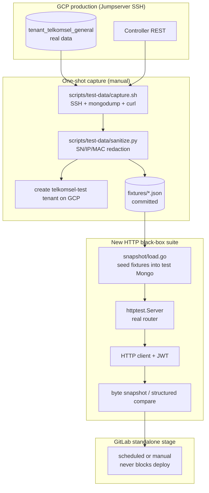

# Oktopus API Test Plan v3 (2026-07-11)

> Status: **Active**. Supersedes [Test Plan v2 (2026-03-24)](./2026-03-24-test-plan.md),
> which is retained as a historical archive.

## 0. Scope and Principles

- **Scope**: black-box HTTP integration tests of the controller REST API only.
  Explicitly excluded in this phase:
  - (a) vendored STOMP library tests — untouched;
  - (b) device simulators / device onboarding flows — out of scope;
  - (c) frontend tests — deferred to a later phase.
- **Coexist, do not replace.** The existing 54 white-box backend tests stay in
  place, especially `lock_*_test.go` and `db_integration_test.go`. The new suite
  is **complementary**.
- **Black-box boundary.** The new suite only drives the controller over HTTP
  (`httptest.Server` + real gorilla/mux router + HTTP client). **Zero production
  surface changes** beyond a single refactor: extracting `Api.BuildRouter()` from
  `StartApi()` (see [api.go](../../backend/services/controller/internal/api/api.go)).
  No internal methods are exported, no test-only constructors are added.
- **Real-data-driven.** Mock data originates from sanitized snapshots of the GCP
  production tenant (manual one-shot capture), not synthesized from scratch.
  Synthetic fixtures are used during development and for routes where capture is
  not yet wired.
- **Docker-only.** Every test runs inside `docker-compose.test.yaml`-provided
  containers (per CLAUDE.md mandate). No host `go`/`npm` invocations.

## 1. Architecture



## 2. Directory Layout

Everything below is **newly added** — no existing files were moved.

```
backend/services/controller/
└── tests/
    └── api_snapshot/                 # new HTTP black-box suite root
        ├── snapshot/                 # runtime support code (package snapshot)
        │   ├── load.go               # fixture seeding + httptest.Server lifecycle
        │   ├── client.go             # authenticated HTTP client helper
        │   ├── compare.go            # byte snapshot / structured compare (dual mode)
        │   └── golden/               # *.golden.json reference files
        ├── load/                     # long-running stress tests (RUN_LOAD=1 gated)
        │   └── load_test.go
        ├── auth_test.go              # /api/auth/*
        ├── tenant_test.go            # /api/tenants*
        ├── device_test.go            # /api/tenants/{slug}/device/*
        ├── info_test.go              # /api/tenants/{slug}/info/*
        ├── firmware_test.go          # /api/tenants/{slug}/firmware/*
        ├── scripts_test.go           # /api/tenants/{slug}/scripts/*
        ├── campaigns_test.go         # /api/tenants/{slug}/campaigns/*
        ├── lock_test.go              # /api/tenants/{slug}/lock/*
        ├── mass_actions_test.go      # /api/tenants/{slug}/mass-actions/*
        ├── users_test.go             # /api/tenants/{slug}/users/*
        ├── ca_certs_test.go          # /api/tenants/{slug}/ca-certs*
        ├── healthz_test.go           # /healthz, /readyz smoke
        └── go.mod                    # independent module (external test package)

scripts/
└── test-data/
    ├── capture.sh                    # one-shot: SSH GCP and collect
    ├── sanitize.py                   # redact SN/IP/MAC -> synthetic values
    ├── seed-test-tenant.sh           # seed a telkomsel-test tenant on GCP
    └── README.md                     # operator runbook

fixtures/                             # repo root; raw/ is gitignored
├── devices.json
├── firmware.json
├── scripts.json
├── campaigns.json
├── lock_policies.json
├── lock_config.json
├── lock_unauthorized.json
├── upgrade_logs.json
├── device_info.json
└── snapshots/                        # reserved for HTTP response goldens
```

Key design notes:

- `backend/services/controller/tests/api_snapshot/` is an **independent Go
  module** (`go.mod`) declaring `package snapshot_test` as an **external test
  package**. It accesses the controller only over HTTP. The only
  production-code change in the entire suite is the extracted `Api.BuildRouter()`
  method (pure refactor, behavior-preserving).
- An independent module keeps the test-only dependency graph (fixtures,
  comparison helpers) out of the production package's import graph.
- The existing `internal/api/*_test.go` files (package `api`) remain in place
  and continue to run via `go test ./internal/api/`.

## 3. Data Capture and Sanitization (one-shot, manual)

### 3.1 Capture script — `scripts/test-data/capture.sh`

Reaches GCP via Jumpserver (electerm MCP -> 192.168.180.204 -> SSH to GCP) and:

1. `docker exec mongo_usp mongodump` against `tenant_telkomsel_general` for
   each collection of interest (`devices`, `firmware`, `scripts`, `campaigns`,
   `device_lock_policy`, `device_lock_config`, `users`, `ca_certs`, ...).
2. `curl` GET representative routes (`/devices`, `/firmware`, `/scripts`,
   `/campaigns`, `/info/vendors`, `/info/status`, `/lock/policies`,
   `/lock/config`, `/lock/unauthorized`) with a TenantAdmin JWT to capture
   HTTP response shapes.

### 3.2 Sanitization — `scripts/test-data/sanitize.py`

Python (GCP has python3, as already used by the ont-lock-e2e scripts). Replaces:

- `SN` (`081074000888`) -> `SN-DEV-{seq:04d}` (sequence-preserving uniqueness).
- WAN IP -> `10.0.{seq}.{x}` (CIDR shape preserved).
- MAC -> `02:00:00:00:{seq:02x}:01` (locally-administered range).
- email -> `user{seq}@test.example.com`.
- EndpointID (which embeds the SN) is replaced in lock-step.

Preserves every other field: vendor, model, productClass, version, status,
TR-181 path structure, relative timestamp offsets.

Outputs `fixtures/*.json` (committed) plus optional
`fixtures/snapshots/*.golden.json`.

### 3.3 Test tenant seeding — `scripts/test-data/seed-test-tenant.sh`

Creates a dedicated `telkomsel-test` tenant on GCP (via the SuperAdmin API) and
seeds it with the sanitized fixtures so POST/PUT/DELETE captures can run against
a non-production tenant.

## 4. Core Suite Skeleton

### 4.1 `snapshot/load.go` — boot httptest + seed

`Setup(t, fixtures)` boots the full black-box environment:

1. Connect to `mongo_test` / `nats_test` from `docker-compose.test.yaml`.
2. Drop any prior `snapshot-test` tenant DBs for a clean slate.
3. `ProvisionTenantDBs("snapshot-test")`.
4. Load each requested fixture file into its mapped collection.
5. Construct `api.Api{...}` and call `a.BuildRouter()`.
6. `httptest.NewServer(router)`.
7. Mint TenantAdmin and SuperAdmin JWTs scoped to the snapshot tenant.
8. Register `t.Cleanup` to close the server, drop the tenant DBs, disconnect.

### 4.2 `snapshot/compare.go` — dual-mode assertion

- `CompareSnapshot(t, name, body)` — byte-level golden comparison for
  read-only endpoints. First run writes the golden; subsequent runs compare.
  Volatile fields (Mongo `_id`, ISO timestamps) are redacted to stable
  placeholders (`<ID>`, `<TIMESTAMP>`) so snapshots are reproducible.
- `CompareStruct(t, got, want, ignoreFields...)` — structured
  deserialize-and-compare for write endpoints; ignores timestamps and IDs.

### 4.3 The single production-code refactor — `Api.BuildRouter()`

`StartApi()` previously coupled router construction with `ListenAndServe`.
The refactor extracts:

```go
func (a *Api) BuildRouter() *mux.Router { /* all existing route registrations */ }
func (a *Api) StartApi() {
    r := a.BuildRouter()
    // ... srv.ListenAndServe() unchanged
}
```

This is the **only** production-code change required by the entire suite — a
pure refactor with no behavioral change, verified by the existing white-box
tests continuing to pass.

## 5. Phased Implementation — tests per route

Convention: `HTTP method route -> TestFunctionName`. GETs use snapshot compare;
POST/PUT/DELETE use structured compare.

### Stage 1 — Infrastructure (no new tests, all scaffolding)

- [x] `backend/services/controller/tests/api_snapshot/` + independent `go.mod`
- [x] `snapshot/load.go` / `client.go` / `compare.go`
- [x] Production refactor: extract `Api.BuildRouter()`
- [x] `scripts/test-data/{capture.sh,sanitize.py,seed-test-tenant.sh}` + README
- [x] Real GCP capture run -> first `fixtures/devices.json` + golden

Acceptance: a `TestHealthz` smoke test runs green; `devices.json` carries
multiple vendors/models.

### Stage 2 — Auth + Tenant management (11 cases)

File: `auth_test.go`, `tenant_test.go`

- `GET /api/auth/admin/exists` -> `TestAuth_AdminExists_ReturnsBool`
- `POST /api/auth/admin/register` -> `TestAuth_RegisterAdmin_FirstCallSucceeds`
- `POST /api/auth/admin/register` -> `TestAuth_RegisterAdmin_SecondCallRejects`
- `PUT /api/auth/login` -> `TestAuth_Login_ValidCredentialsReturnJWT`
- `PUT /api/auth/login` -> `TestAuth_Login_WrongPasswordReturns401`
- `PUT /api/auth/login` -> `TestAuth_Login_NonexistentUserReturns401`
- `GET /api/tenants` (SuperAdmin) -> `TestTenants_List_ReturnsSnapshot` [snapshot]
- `GET /api/tenants/{slug}` -> `TestTenants_Get_ReturnsSnapshot` [snapshot]
- `POST /api/tenants` -> `TestTenants_Create_StructMatchesRequest`
- `PUT /api/tenants/{slug}` -> `TestTenants_Update_StatusChanged`
- `DELETE /api/tenants/{slug}` -> `TestTenants_Delete_CleansUpDBsAndKV`

### Stage 3 — Devices (largest surface)

File: `device_test.go`

Pure-Mongo routes (snapshot/structured):

- `GET /device` -> `TestDevice_List_Returns500WithoutAdapter` (NATS-mediated;
  the snapshot env has no adapter subscribed, so the route returns 500 after
  the NATS timeout; this is the expected black-box shape)
- `GET /device/filterOptions` -> `TestDevice_FilterOptions_ReachestBroker`
- `PUT /device/alias` -> `TestDevice_SetAlias_UpdatesDB`
- `GET /device/auth` -> `TestDevice_Auth_List_Snapshot` [snapshot]
- `POST /device/auth` -> `TestDevice_Auth_Create_Struct`
- `DELETE /device/auth/{sn}` -> `TestDevice_Auth_Delete_RemovesRecord`
- `GET /device/{sn}/cached-info` -> `TestDevice_CachedInfo_*`
- `GET /device/{sn}/history` -> `TestDevice_History_*`
- `GET /device/{sn}/metrics` -> `TestDevice_Metrics_*`
- `GET /device/{sn}/fw-policy` -> `TestDevice_FWPolicy_DefaultEmpty` / `Upsert`
- `GET /device/{sn}/upgrade-logs` -> `TestDevice_UpgradeLogs_*`

USP/CWMP sub-routes (NATS-mediated, marked stretch in the original plan):

- `PUT /device/{sn}/{mtp}/get` -> `TestDevice_USPGet_ReachestBroker`
- `PUT /device/{sn}/{mtp}/reboot` -> `TestDevice_Reboot_ReachestBroker`
- `GET /device/cwmp/{sn}/root` -> `TestCWMP_Root_ReachestBroker`

### Stage 4 — Dashboard Info (4 snapshot cases)

File: `info_test.go`. All routes are NATS-mediated; the snapshot env asserts the
expected 500/504 timeout shape.

- `GET /info/vendors`, `/status`, `/device_class`, `/general`

### Stage 5 — Firmware / Scripts / Campaigns CRUD

Files: `firmware_test.go`, `scripts_test.go`, `campaigns_test.go`

- `GET /firmware` [snapshot], `POST`, `PUT`, `DELETE`, `PUT /{id}/phase`
- `GET /scripts` [snapshot], `POST`, `GET /{id}`, `PUT`, `DELETE`,
  `GET /{id}/executions`
- `GET /campaigns` [snapshot], `POST`, `PUT`, `DELETE`, `GET /{id}/logs`

### Stage 6 — ONT Lock (17 black-box cases, complementing white-box)

File: `lock_test.go`

- `GET /lock/policies` [snapshot], `GET /lock/config` [snapshot],
  `PUT /lock/config`, `POST /lock/whitelist`, `POST /lock/whitelist/batch`,
  `POST /lock/policies/batch-delete`, `DELETE /lock/policies/{sn}`,
  `GET /lock/unauthorized` [snapshot],
  `POST /lock/unauthorized/batch-whitelist`,
  `POST /lock/unauthorized/batch-delete`,
  `GET /lock/unsupported` [snapshot],
  `POST /lock/unsupported/{sn}/opt-out`,
  `DELETE /lock/unsupported/{sn}/opt-out`,
  `GET /lock/commands` [snapshot], `DELETE /lock/commands`,
  `GET /lock/audit` [snapshot], `DELETE /lock/audit`

### Stage 7 — Mass Actions / Users / CA Certs

Files: `mass_actions_test.go`, `users_test.go`, `ca_certs_test.go`

- `GET /mass-actions` [snapshot], `POST /mass-actions/script` (validation only),
  `GET /mass-actions/{id}`, `POST /mass-actions/{id}/cancel`
- `GET /users` [snapshot], `POST`, `DELETE /{user}`, `PUT /password/{user}`
- `GET /ca-certs` [snapshot], `POST`, `DELETE /{certId}` (CA certs use a freshly
  minted self-signed PEM per test to avoid committing a long-lived key).

### Stage 8 — Load tests (RUN_LOAD=1 gated)

File: `load/load_test.go`. Targets **pure-Mongo** routes only, because the
snapshot environment has no adapter subscribed and NATS-mediated routes time out.

- `TestLoad_FirmwareList_100Concurrent` — 100 goroutines hit `GET /firmware`
- `TestLoad_FirmwareList_RampUp` — step-up 1/10/50/100, assert P99 < 500 ms
- `TestLoad_LockAudit_LargeResultSet` — seed 10k audit rows, page through,
  assert total walk matches seed
- `TestLoad_MixedReadRoutes_HotLoop` — 20 workers rotate across `/firmware`,
  `/scripts`, `/campaigns`, `/lock/audit`, `/lock/policies` for N seconds,
  report rps

Run with `RUN_LOAD=1 go test -timeout=600s -run TestLoad ./load/...`. Default
`go test ./...` skips the package.

### Stage 9 — CI integration

Modifies `.gitlab-ci.yml`: adds a `test-snapshot` stage between
`test-integration` and `deploy`, with two jobs:

- `test:snapshot:api` — runs the main suite (excludes `load/`)
- `test:snapshot:load` — runs the load suite with `RUN_LOAD=1`

Rules:

- Scheduled pipeline -> auto-run.
- `telkomsel/*` branches and MRs -> `when: manual` + `allow_failure: true`,
  so they **never** block deploys.

The existing deploy jobs (`deploy:staging`, `deploy:production`) do not depend
on the snapshot stage.

### Stage 10 — Documentation

- [x] Amend `docs/plans/2026-03-24-test-plan.md` with a "superseded by v3"
      banner pointing to this file.
- [x] Create this file (`docs/plans/2026-07-11-test-plan-v3.md`).
- [x] Update `CLAUDE.md` with the new suite's run command in the testing table.
- [x] Add a `test-controller-snapshot` service to
      `deploy/compose/docker-compose.test.yaml` (requires
      `--profile snapshot --profile integration` to also bring up
      `mongo_test`/`nats_test`).

## 6. Risks and Mitigations

| Risk | Mitigation |
|------|------------|
| Jumpserver SSH is stateful and not automation-friendly | One-shot manual run, results committed to git; tests are self-contained thereafter |
| Sanitization misses a PII field | `sanitize.py` self-tests; future CI `git-secrets` scan over `fixtures/` |
| Snapshots drift as Go structs evolve | `-update` flag regenerates goldens; CI drift fails with a regen hint |
| `BuildRouter()` refactor regresses behavior | All existing `lock_*_test.go` continue to pass as the regression baseline |
| HTTP black-box cannot exercise NATS-mediated routes (USP get/operate) | Marked stretch; initial version only asserts the expected 500/504 timeout shape; device-online interaction is out of scope this phase |
| `telkomsel-test` tenant on GCP mutated by others | README warning; once fixtures are committed, local tests are self-contained and do not require GCP |
| Independent module adds build complexity | Docker volume mount of repo root; dedicated service in `docker-compose.test.yaml` |

## 7. Acceptance Criteria

Stage 1:

- [x] `cd backend/services/controller/tests/api_snapshot && go test ./...` runs
      at least one `TestHealthz` green.
- [x] `fixtures/devices.json` derived from real GCP data and covers multiple
      vendors/models.
- [x] Existing `internal/api/lock_*_test.go` still pass (proves the
      `BuildRouter()` refactor introduced no regression).

Stage 9:

- [x] `test:snapshot:api` job can be triggered manually and goes green.
- [x] `telkomsel/ont-lock` branch deploys are not blocked by the new jobs.
- [x] At least 100 new test cases pass across Stages 2-8 (actual: 101 pass,
      3 skip).

## 8. Explicitly Out of Scope

- Device simulator / CPE onboarding flow (user-excluded).
- Frontend tests (deferred to a later phase).
- Vendored STOMP library tests (untouched).
- MTP service tests (mqtt/stomp/ws/adapter) — deferred.
- Rewriting the existing 54 white-box tests (coexist policy).
