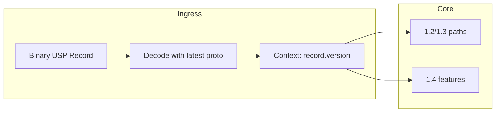
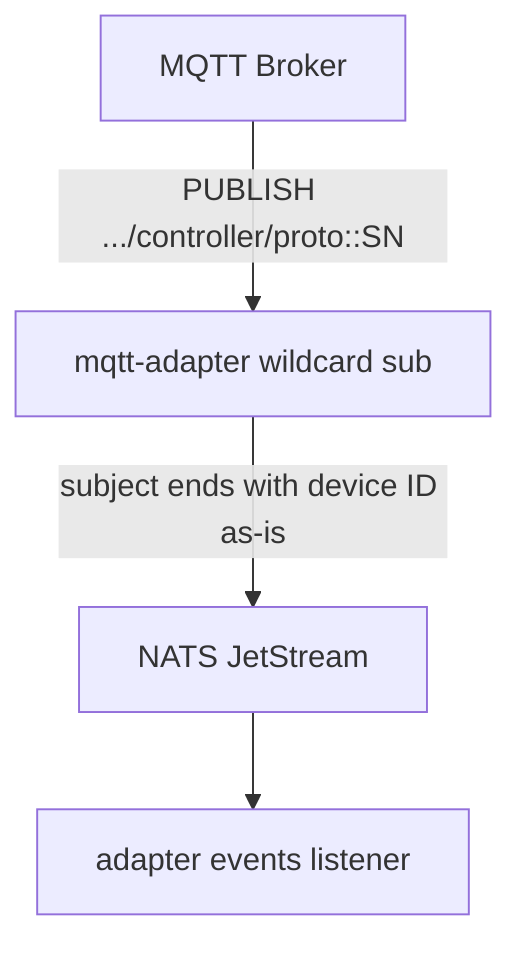
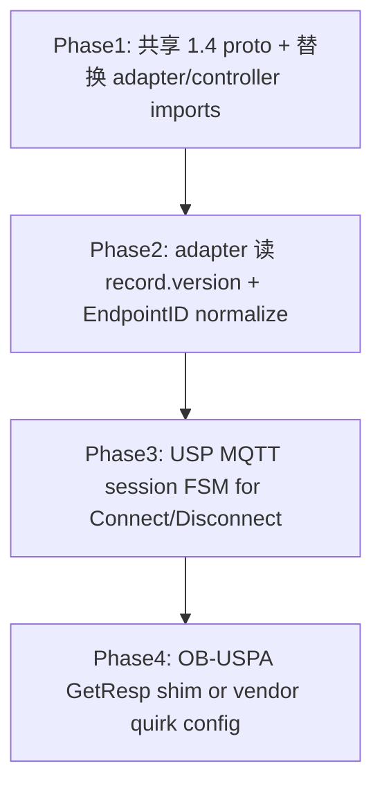

<!-- 6f25d3a9-dc63-4d76-b0bc-4d2388519560 -->
# USP 多版本兼容架构可行性评估

## 结论（直接回答「可以行吗？」）

**可以行，且是成熟 TR-369 Controller 应有的长期方向**——但需区分两类问题：

| 问题类型 | 你的方案是否足够 | 说明 |
|---------|----------------|------|
| 平台同时服务 1.2 / 1.3 / 1.4 设备、多种 Endpoint ID 格式 | **是** | Protobuf 向前兼容 + 接入层归一化是标准做法 |
| 当前 Telkomsel `proto::081074000002` / `081074000999` 无法注册 | **否（单独不够）** | 根因是 OB-USPA **非 BBF 规范的 wire 编码**和 **USP 会话握手缺失**，不是「平台只认一种 proto 文件版本」 |

因此：**架构建议采纳；不能指望「只升级到 1.4 proto」就修好现网这两台设备。**

---

## 一、协议层：升级到 1.4 Proto「通吃低版本」

### 理论：正确

Protobuf 向前兼容机制成立：

- 用**最新** `usp_record.proto` / `usp_msg.proto` 编译 Go 代码
- 旧设备报文缺少新 field → 解析成功，新 field 为 default
- 新设备报文含 1.4 特性 → 完整解码
- 业务层可读 [`Record.version`](backend/services/mtp/adapter/internal/usp/usp-record-1-2.proto)（规范字符串如 `"1.2"` / `"1.3"` / `"1.4"`）做分支



### Oktopus 现状：尚未统一，且 outgoing 版本字符串不一致

| 组件 | Record/Msg proto | 出站 `Record.version` |
|------|------------------|----------------------|
| [adapter 注册路径](backend/services/mtp/adapter/internal/events/usp_handler/info.go) | **1.2** | `"1.0"`（[usp.go](backend/services/mtp/adapter/internal/usp/usp.go)） |
| [controller](backend/services/controller/internal/usp/) | **1.3** | `"1.0"`（[utils.go](backend/services/controller/internal/usp/usp_utils/utils.go)） |
| ws / ws-adapter | 1.3 | 同 controller |
| mqtt-adapter | 无 proto（透传二进制） | — |

仓库内**没有** 1.4 / 1.5 / usp-record-1-0 的 proto 文件。

**统一到 1.4 的价值（即使暂不修 Telkomsel）：**

- 消除 adapter(1.2) 与 controller(1.3) 双栈维护成本
- 为 REGISTER/DEREGISTER（1.3+）、1.4 新消息类型预留字段
- 与 BBF 官方主线对齐，降低后续升级 1.5 的 diff

**统一到 1.4 的风险 / 工作量：**

- 需全量替换 import 路径、重新生成 `.pb.go`、跑 adapter + controller + ws 全链路测试
- 1.3→1.4 有**新消息类型**（非仅 optional 字段），业务层需显式处理或忽略未知 `body` oneof
- `Record.version` 字符串与 **proto 文件版本**不是同一概念：Oktopus 出站写 `"1.0"`，设备常回 `"1.3"`——分支逻辑应基于**对端报文中的 `record.version`**，而非假设平台 proto 版本

### 为何不能修复 `081074000002`

pcap + Go 解码已证实：设备 GET_RESP 在 **usp-msg-1-2 / 1-3 / 1-4 下均无法 `proto.Unmarshal`**，因为 wire type 与 BBF 定义不一致（例如 `err_code` 用 varint 而非 fixed32、`ResolvedPathResult` 参数编码方式错误）。这是**编码实现错误**，不是「解析器版本太旧」。

注册失败点：[info.go `parseDeviceInfoMsg`](backend/services/mtp/adapter/internal/events/usp_handler/info.go) 第 3 步 inner `Msg` 解析 → `REJECTED: invalid USP message payload`。

---

## 二、网络层：MQTT 通配符 + Topic 解析

### 你的方案：Oktopus **已基本实现**

[`mqtt-adapter/bridge.go`](backend/services/mtp/mqtt-adapter/internal/bridge/bridge.go) 已订阅：

- `oktopus/usp/v1/+/controller/+`（设备 → 平台）
- 向 `oktopus/usp/v1/{tenant}/agent/{deviceID}` 下发

`+` 已覆盖 `081074000002` 与 `proto::081074000002` 两种末段格式；无需改为 `#` 除非未来 topic 深度超过当前 6 段结构。

[`events.go`](backend/services/mtp/adapter/internal/events/events.go) 从 NATS subject 取 `device = subject[len-2]`，**原样保留** `proto::` 前缀作为平台内 Device ID（与 MQTT username、NATS `device.usp.v1.<tenant>.<sn>` 一致）。



### 可选增强（非阻塞现网）

- **EndpointID 归一化层**：`proto::SN` / `oui:OUI:SN` → 内部 `canonical_id` + `display_sn`，便于跨租户报表与 lock/campaign 按纯 SN 匹配
- **租户级策略**：某些运营商强制 `proto::` 前缀，另一些用纯 SN——策略放在 MTP Adapter，而非写死 broker 订阅

**当前 Telkomsel 故障与 topic 格式无关**：日志已显示 `new device: tenant=telkomsel device=proto::081074000002`，MQTT 层识别成功。

---

## 三、分层架构 vs Oktopus 现有结构

你建议的三层与现网映射：

| 你的层 | Oktopus 对应 | 差距 |
|--------|-------------|------|
| 接入网关 (Broker) | [mqtt](backend/services/mtp/mqtt/) / ws / stomp | 已具备 |
| 协议适配 (MTP Adapter) | [mqtt-adapter](backend/services/mtp/mqtt-adapter/) + [adapter](backend/services/mtp/adapter/) | mqtt-adapter 仅转发；**USP 解码在 adapter**，且用 1.2 |
| 业务 (Core) | [controller](backend/services/controller/) | 用 1.3；[message_interceptor](backend/services/controller/internal/usp/message_interceptor.go) 存解析失败到 `messages_errors` |

**建议的长期形态（与你描述一致）：**

1. **单一 proto 源码树**（建议 `backend/pkg/usp/` 或共享 module），全服务引用 1.4 生成代码
2. **adapter 作为唯一 USP 解码/归一化点**：Record 类型路由、EndpointID 清洗、`record.version` 写入 context
3. **controller 只处理已结构化的 USP 业务**，或继续收 raw 但用同一套 1.4 库

---

## 四、`081074000999`：方案未覆盖的会话层问题

该设备失败模式不同：

```
REJECTED: expected NoSessionContext record, got MQTTConnect
REJECTED: expected NoSessionContext record, got Disconnect
```

[`info.go`](backend/services/mtp/adapter/internal/events/usp_handler/info.go) 在注册 GET 流程中**只接受** `NoSessionContext` + GET_RESP；设备先发 USP **MQTTConnect / Disconnect** Record（TR-369 MTP 会话建立），平台未实现该状态机 → 永远进不了 GET_RESP。

这属于 **USP over MQTT 会话握手**，不是 proto 版本升级或 topic  wildcard 能自动解决的；需在 adapter 增加：

- 识别 `SessionContext` / MQTTConnect / Disconnect Record
- 完成 session open 后再发 GET / 收 GET_RESP

---

## 五、综合建议（评估结论，不含实施）

### 采纳的部分

1. **统一升级到 BBF 最新 stable proto（1.4 或跟进 1.5）** — 减少双栈、符合向前兼容原则
2. **在适配层读取 `record.version` 打标签** — 便于渐进启用 1.4 特性
3. **EndpointID 归一化** — 提升多运营商可维护性（topic  wildcard 已够用）

### 必须额外处理才能修 Telkomsel 现网

1. **OB-USPA GetResp 兼容**：lenient 解码、或设备固件修复、或与厂商确认 wire 差异规范
2. **USP MQTT 会话握手**：处理 MQTTConnect/Disconnect 后再走 DeviceInfo GET（`081074000999`）
3. **对齐出站 `Record.version`**：评估是否应发送 `"1.3"`/`"1.4"` 而非硬编码 `"1.0"`（与对端期望有关）

### 不推荐的做法

- 在代码里维护三套 1.2/1.3/1.4 并行解析器（违背 Protobuf 设计）
- 指望仅换 proto 文件不修 adapter 会话状态机即可上线全球设备

---

## 六、若未来要实施时的推荐顺序（供参考，本次不执行）



Phase 1–2 提升平台架构；Phase 3–4 才针对当前 Telkomsel 设备类问题。

---

## 参考代码锚点

- 注册解析与拒绝逻辑：[info.go L65–68, L90+](backend/services/mtp/adapter/internal/events/usp_handler/info.go)
- MQTT 通配符订阅：[bridge.go](backend/services/mtp/mqtt-adapter/internal/bridge/bridge.go)
- NATS 设备 ID 提取：[events.go L48–55](backend/services/mtp/adapter/internal/events/events.go)
- Controller 解析失败落库：[message_interceptor.go](backend/services/controller/internal/usp/message_interceptor.go)
