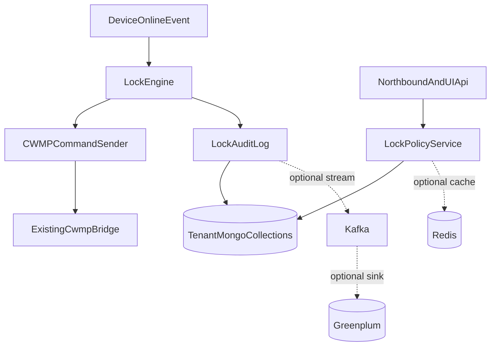

<!-- 9a3da817-7ca0-4d45-9573-0e270360a830 -->
---
todos:
  - id: "lock-data-model"
    content: "Design tenant-scoped Mongo collections and indexes for lock policies, config, unauthorized devices, command attempts, and audit logs."
    status: pending
  - id: "lock-engine"
    content: "Implement lock evaluation and command dispatch using existing NATS online events and CWMP bridge."
    status: pending
  - id: "lock-apis"
    content: "Add tenant-scoped backend APIs for whitelist, blacklist, config, batch import, unauthorized devices, command status, and audit history."
    status: pending
  - id: "lock-frontend"
    content: "Add frontend pages and menus for ONT Lock operations using existing tenant API prefix patterns."
    status: pending
  - id: "scale-adapters"
    content: "Add optional Redis/Kafka/Greenplum integration boundaries or adapters without making them required for local Oktopus operation."
    status: pending
  - id: "verification"
    content: "Add focused backend tests for policy mutual exclusion, CIDR matching, switch behavior, retries, and tenant isolation."
    status: pending
isProject: false
---
# Telkomsel ONT Lock Implementation Scope

## Confirmed Direction
- Scope includes all platform-side lock-network features from [docs/Telkomsel ONT Lock 锁网系统方案 — 完整设计记录.md](docs/Telkomsel%20ONT%20Lock%20%E9%94%81%E7%BD%91%E7%B3%BB%E7%BB%9F%E6%96%B9%E6%A1%88%20%E2%80%94%20%E5%AE%8C%E6%95%B4%E8%AE%BE%E8%AE%A1%E8%AE%B0%E5%BD%95.md) except SLB / gateway implementation and存量设备锁网固件 OTA.
- Reuse Oktopus core: tenant-scoped APIs, MongoDB tenant databases, NATS events, and CWMP SetParameterValues.
- Treat Kafka / Redis / Greenplum as optional scale-out integration points, not replacements for Oktopus core data ownership.

## Proposed Architecture

## Main Implementation Areas
- Backend data model: add tenant-scoped lock policy, lock config, unauthorized devices, command attempts, and audit logs under the existing `TenantDB` pattern in [backend/services/controller/internal/db/tenant.go](backend/services/controller/internal/db/tenant.go).
- Backend APIs: add tenant-scoped lock routes under `/api/tenants/{slug}` in [backend/services/controller/internal/api/api.go](backend/services/controller/internal/api/api.go), rather than introducing an unrelated `/api/v1/lock/*` namespace.
- Evaluation engine: implement SN blacklist priority, SN + CIDR whitelist, master switch, auto-lock switch, and PENDING behavior in controller-side code.
- Device trigger path: subscribe to existing `device.v1.*.online` NATS pattern, similar to [backend/services/controller/internal/api/campaign_engine.go](backend/services/controller/internal/api/campaign_engine.go), and evaluate devices on connect.
- Command path: reuse existing CWMP helpers and NATS bridge from [backend/services/controller/internal/api/cwmp.go](backend/services/controller/internal/api/cwmp.go) and [backend/services/controller/internal/cwmp/cwmp.go](backend/services/controller/internal/cwmp/cwmp.go) to set `Device.X_TELKOMSEL_OntLock.Lock`.
- Frontend: add a tenant-scoped Device Admission / ONT Lock section for blacklist, whitelist, unauthorized devices, batch import, config switches, command status, and audit history.

## Remaining Doubts After Review
- No blocking疑问 remains for starting a detailed implementation plan if we adopt the hybrid approach above.
- Non-blocking product details still need defaults during implementation: audit retention, batch upload file template, exact CSV/Excel error report format, and whether batch add-white immediately unlocks online devices.
- Scale-out middleware should be implemented behind interfaces or env-gated adapters so the core feature works in current Docker deployment and can be extended for K8S / large-scale customer deployment.

## Out Of Scope For This Phase
- SLB / Nginx port mapping and HA design.
- 存量设备锁网固件 OTA workflow.
- ONT firmware-side behavior such as persistence, anti-flash, local firewall behavior, and custom data model implementation.